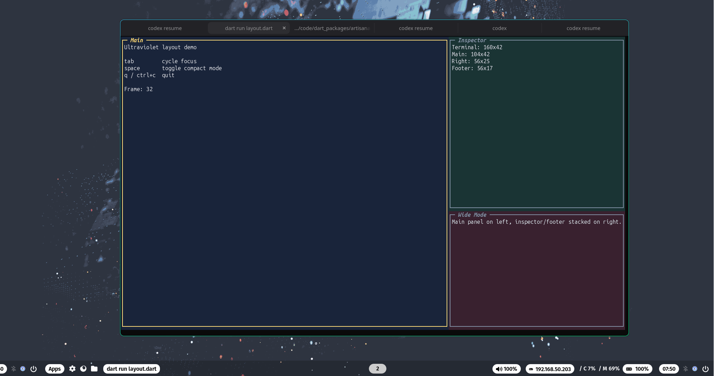

# Artisanal

A **full-stack terminal toolkit** for Dart, combining CLI I/O, Lip Gloss styling, Bubble Tea TUI, and Ultraviolet rendering.

---

## ✨ Features

- **CLI Utilities** — Build powerful command-line tools with intuitive I/O handling
- **TUI Framework** — Create rich terminal user interfaces with Bubble Tea
- **Styling** — Design beautiful terminal output with Lip Gloss
- **Markdown Rendering** — Render Markdown to the terminal with Ultraviolet
- **Composable Components** — Reuse and combine components for complex UIs
- **Cross-Platform** — Works seamlessly on macOS, Linux, and Windows
- **Extensible** — Easily integrate with other Dart packages and libraries

---

## 🖼️ Screenshots


Raycast maze:


Conway's Game of Life:


Metaballs / marching squares:


Layout example (`example/layout.dart`):




## 🚀 Code Examples

### 1. Basic Console Output

```dart
import 'package:artisanal/artisanal.dart';

void main() {
  final console = Console();

  console.write('Hello');
  console.writeln('World');
}
```

---

### 2. Styled Text

```dart
import 'package:artisanal/style.dart';

void main() {
  final style = Style().foreground(Colors.blue).bold();
  print(style.render('Hello, Styled World!'));
}
```

---

### 3. Progress Bar

```dart
import 'package:artisanal/artisanal.dart';

void main() async {
  final console = Console();
  await console.task(
    'Downloading data...',
    run: () async {
      await Future.delayed(Duration(seconds: 2));
      return TaskResult.success;
    },
  );
}
```

---

### 4. Table Rendering

```dart
import 'package:artisanal/tui.dart';

void main() {
  final table = Table()
      .headers(['ID', 'Name', 'Status'])
      .row(['1', 'Kasm', 'Running'])
      .row(['2', 'Vault', 'Stopped'])
      .border(Border.rounded)
      .padding(1);

  print(table.render());
}
```


---

### 5. Layouts

#### Horizontal Layout

```dart
import 'package:artisanal/style.dart';
import 'package:artisanal/tui.dart';

void main() {
  final style1 = Style().foreground(Colors.red);
  final style2 = Style().foreground(Colors.blue);

  print(Layout.joinHorizontal(VerticalAlign.top, [
    style1.render('Left'),
    style2.render('Right'),
  ]));
}
```

#### Vertical Layout

```dart
import 'package:artisanal/tui.dart';

void main() {
  print(Layout.joinVertical(HorizontalAlign.center, [
    'Header',
    'Content',
    'Footer',
  ]));
}
```

---

### 6. Custom Themes

```dart
import 'package:artisanal/style.dart';

void main() {
  final myTheme = ThemePalette(
    accent: Colors.hex('#ff00ff'),
    text: Colors.white,
    background: Colors.black,
  );

  final titleStyle = Style()
      .foreground(myTheme.accent)
      .background(myTheme.background ?? Colors.none)
      .bold();

  print(titleStyle.render('Custom Themed Title'));
}
```

---

### 7. Interactive Prompts

```dart
import 'package:artisanal/artisanal.dart';

void main() async {
  final console = Console();

  final name = await console.ask('What is your name?');
  print('Hello, $name!');
}
```


### 9. UV Renderer Example

```dart
import 'dart:io';
import 'package:artisanal/artisanal.dart';
import 'package:artisanal/uv.dart';
import 'package:image/image.dart' as img;

void main() {
  final io = Console(out: (s) => stdout.write(s), err: (s) => stderr.write(s));

  // Create a simple gradient image
  final image = img.Image(width: 100, height: 100);
  for (var y = 0; y < 100; y++) {
    for (var x = 0; x < 100; x++) {
      image.setPixelRgba(x, y, x * 2, y * 2, 150, 255);
    }
  }

  // Create layers
  final imageLayer = newLayer(KittyImageDrawable(image, columns: 20, rows: 10))
    ..setId('image')
    ..setX(5)
    ..setY(2);

  final textLayer =
      newLayer(StyledString('\x1b[1;33mHello from Compositor!\x1b[0m'))
        ..setId('text')
        ..setX(2)
        ..setY(1);

  final compositor = Compositor([imageLayer, textLayer]);

  // Render to a canvas
  final canvas = Canvas(40, 15);
  canvas.compose(compositor);

  io.write(canvas.render());
  io.write('\nDone.\n');
}
```


---

### 10. TUI Components Example

```dart
import 'package:artisanal/tui.dart';

class CounterModel extends Model {
  int count = 0;

  @override
  Cmd? init() => null;

  @override
  (Model, Cmd?) update(Msg msg) {
    if (msg is KeyMsg && msg.key.isChar('i')) {
      count++;
    } else if (msg is KeyMsg && msg.key.isChar('d')) {
      count--;
    }
    return (this, null);
  }

  @override
  String view() => 'Count: $count\nPress "i" to increment, "d" to decrement.';
}

void main() async {
  await runProgram(CounterModel(), options: ProgramOptions(altScreen: true));
}
```

### 10. Markdown Rendering

```dart
import 'package:artisanal/glamour.dart';

void main() {
  const markdown = '''
# Glamour Demo

### 10. Markdown Rendering

```dart
import 'package:artisanal/glamour.dart';

void main() {
  const markdown = '''
# Glamour Demo

This is a **bold** statement.
This is an *italic* statement.

Visit [GitHub](https://github.com) for more info.
''';

  final renderer = GlamourRenderer();
  print(renderer.render(markdown));
}
```


