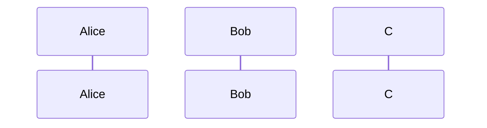
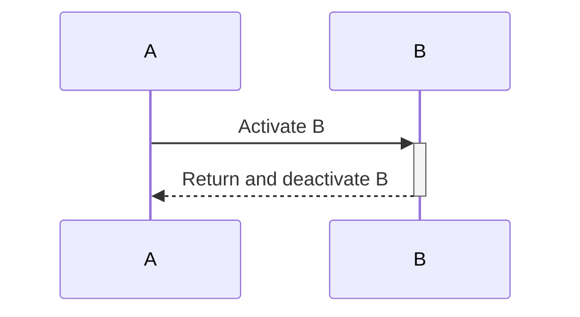
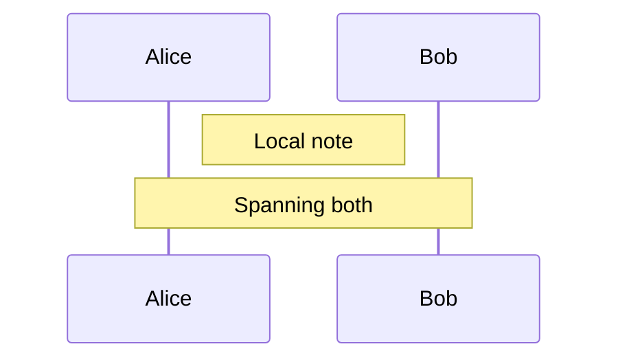
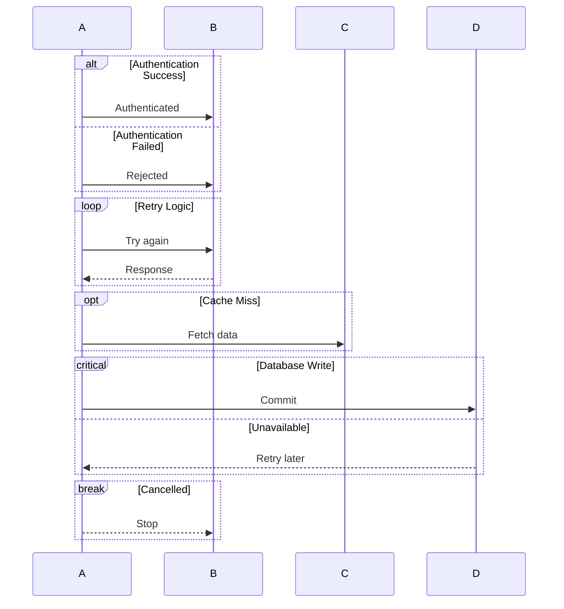
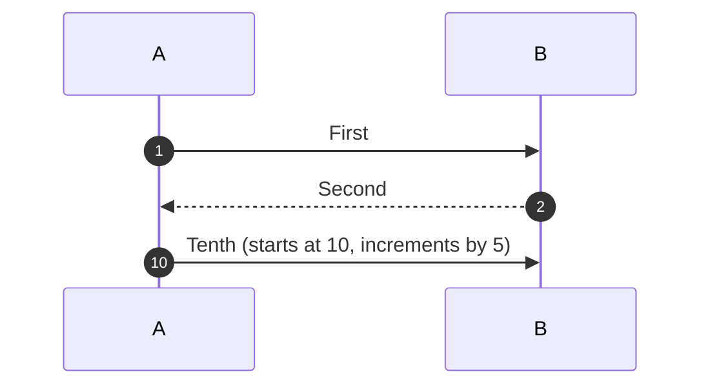
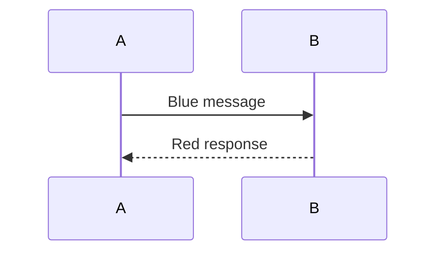
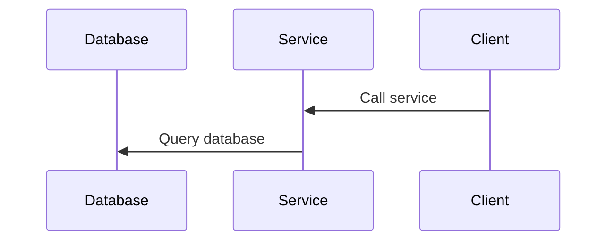
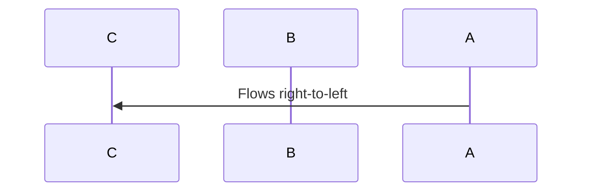

# Draw charts in the terminal

Use the charting helpers for sparklines, line and area charts, histograms,
heatmaps, pie charts, and sequence diagrams that belong naturally in terminal
output. They draw into Ultraviolet buffers and can be printed as text or placed
inside a widget app.

The API is currently exported by `package:artisanal/artisanal.dart`.

## Quick Start (Sparkline)

```dart
import 'package:artisanal/artisanal.dart' as chart;

void main() {
  final values = [12, 18, 22, 19, 25, 29, 31, 28, 24, 26, 30, 34];
  final lines = chart.renderChartLines(40, 3, (screen, area) {
    chart.drawSparkline(
      screen,
      area,
      values,
      style: chart.uvStyleFromHex('#56ccf2'),
      showGrid: true,
      gridStyle: chart.uvStyleFromHex('#3b4252'),
    );
  });
  print(lines.join('\n'));
}
```

## Line Chart

```dart
import 'dart:math' as math;
import 'package:artisanal/artisanal.dart' as chart;

void main() {
  final series = _series(60, seed: 13, min: 20, max: 90);
  final lines = chart.renderChartLines(64, 12, (screen, area) {
    chart.drawLineChart(
      screen,
      area,
      series,
      lineStyle: chart.uvStyleFromHex('#56ccf2'),
      showGrid: true,
      gridRows: 3,
      gridCols: 3,
      gridStyle: chart.uvStyleFromHex('#3b4252'),
      xLabels: const ['-60s', '-30s', 'now'],
      yLabels: const ['100%', '50%', '0%'],
      labelStyle: chart.uvStyleFromHex('#3b4252'),
    );
  });
  print(lines.join('\n'));
}

List<double> _series(
  int count, {
  required int seed,
  required double min,
  required double max,
}) {
  final rng = math.Random(seed);
  var value = (min + max) / 2;
  return List<double>.generate(count, (i) {
    value += (rng.nextDouble() * 2 - 1) * ((max - min) * 0.08);
    value = value.clamp(min, max).toDouble();
    return value;
  }, growable: false);
}
```

## Ribbon / Area Chart

```dart
import 'dart:math' as math;
import 'package:artisanal/artisanal.dart' as chart;

void main() {
  final seriesA = _series(60, seed: 13, min: 20, max: 90);
  final seriesB = _series(60, seed: 42, min: 10, max: 75);
  final seriesC = _series(60, seed: 77, min: 5, max: 55);

  final lines = chart.renderChartLines(64, 12, (screen, area) {
    final styles = [
      chart.uvStyleFromHex('#00bbf9'),
      chart.uvStyleFromHex('#00f5d4'),
      chart.uvStyleFromHex('#f15bb5'),
    ];
    chart.drawRibbonChart(
      screen,
      area,
      [seriesA, seriesB, seriesC],
      styles: styles,
      showGrid: true,
      gridRows: 2,
      gridStyle: chart.uvStyleFromHex('#3b4252'),
    );
  });

  print(lines.join('\n'));
}

List<double> _series(
  int count, {
  required int seed,
  required double min,
  required double max,
}) {
  final rng = math.Random(seed);
  var value = (min + max) / 2;
  return List<double>.generate(count, (i) {
    value += (rng.nextDouble() * 2 - 1) * ((max - min) * 0.08);
    value = value.clamp(min, max).toDouble();
    return value;
  }, growable: false);
}
```

## Histogram

```dart
import 'dart:math' as math;
import 'package:artisanal/artisanal.dart' as chart;

void main() {
  final values = _series(50, seed: 99, min: 0, max: 100);
  final lines = chart.renderChartLines(64, 10, (screen, area) {
    chart.drawHistogram(
      screen,
      area,
      values,
      barStyle: chart.uvStyleFromHex('#9b5de5'),
      axisStyle: chart.uvStyleFromHex('#3b4252'),
      showGrid: true,
      gridRows: 3,
      gridCols: 2,
      gridStyle: chart.uvStyleFromHex('#3b4252'),
      xLabels: const ['0', 'mid', 'max'],
      yLabels: const ['100', '50', '0'],
      labelStyle: chart.uvStyleFromHex('#3b4252'),
    );
  });
  print(lines.join('\n'));
}

List<double> _series(
  int count, {
  required int seed,
  required double min,
  required double max,
}) {
  final rng = math.Random(seed);
  return List<double>.generate(
    count,
    (i) => rng.nextDouble() * (max - min) + min,
    growable: false,
  );
}
```

## Heatmap

```dart
import 'dart:math' as math;
import 'package:artisanal/artisanal.dart' as chart;

void main() {
  final grid = _heatmap(28, 12);
  final lines = chart.renderChartLines(64, 12, (screen, area) {
    chart.drawHeatmap(
      screen,
      area,
      grid,
      ramp: chart.ChartRamp.thermal(),
      showGrid: true,
      gridRows: 3,
      gridCols: 4,
      gridStyle: chart.uvStyleFromHex('#3b4252'),
    );
  });
  print(lines.join('\n'));
}

List<List<double>> _heatmap(int width, int height) {
  final rng = math.Random(7);
  return List.generate(
    height,
    (y) => List<double>.generate(
      width,
      (x) => (math.sin(x * 0.22) + math.cos(y * 0.31)) * 0.25 +
          rng.nextDouble() * 0.5,
      growable: false,
    ),
    growable: false,
  );
}
```

## Pie Chart

```dart
import 'package:artisanal/artisanal.dart' as chart;

void main() {
  final lines = chart.renderChartLines(40, 12, (screen, area) {
    final styles = [
      chart.uvStyleFromHex('#ff006e'),
      chart.uvStyleFromHex('#8338ec'),
      chart.uvStyleFromHex('#3a86ff'),
      chart.uvStyleFromHex('#ffbe0b'),
    ];
    chart.drawPieChart(
      screen,
      area,
      [30, 20, 15, 35],
      styles: styles,
      donut: true,
      useBackground: true,
    );
  });
  print(lines.join('\n'));
}
```

Notes:

- Pie/donut rendering uses sub-cell sampling with quarter/half block glyphs,
  which gives smoother circular edges than full-cell fill alone.

## Crosshair Overlay

```dart
import 'package:artisanal/artisanal.dart' as chart;

void main() {
  final lines = chart.renderChartLines(40, 12, (screen, area) {
    chart.drawLineChart(screen, area, [12, 20, 18, 30, 22]);

    // Standard mode: draw line glyphs on empty cells and tint chart cells.
    chart.drawCrosshair(
      screen,
      area,
      18,
      5,
      style: chart.uvStyleFromHex('#ffff66'),
    );
  });

  print(lines.join('\n'));
}
```

Use `drawOnEmpty: false` when you only want to tint existing chart cells
(useful for compact pie/donut overlays):

```dart
chart.drawCrosshair(
  screen,
  area,
  x,
  y,
  style: chart.uvStyleFromHex('#ffff66'),
  drawOnEmpty: false,
);
```

## Legend and Palette

Legend entries are typically shown in a framed panel so labels stay readable
over dense chart regions.

```dart
import 'package:artisanal/artisanal.dart' as chart;

void main() {
  final ramp = chart.ChartRamp.fromHexes(
    ['#0b132b', '#1b2a6b', '#3a86ff', '#88ffcc', '#ffbe0b', '#ff006e'],
  );

  final entries = List<chart.ChartLegendEntry>.generate(
    ramp.colors.length,
    (i) {
      final t = ramp.colors.length == 1 ? 0.0 : i / (ramp.colors.length - 1);
      final style = ramp.styleFor(t, background: true);
      return chart.ChartLegendEntry(label: 'step $i', style: style);
    },
    growable: false,
  );

  final lines = chart.renderChartLines(30, 6, (screen, area) {
    chart.drawLegend(screen, area, entries, columns: 2, rowGap: 0);
  });

  print(lines.join('\n'));
}
```

## Sequence Diagrams

Sequence diagrams visualize interactions between actors/participants over time.
Artisanal renders a supported subset of Mermaid sequence syntax as terminal cells;
it is not a complete implementation of Mermaid's browser renderer.

### Overview

Sequence diagrams are ideal for documenting:
- API call flows between services
- User authentication workflows
- Request/response patterns
- State machine transitions
- Protocol negotiations

The renderer produces clean ASCII-art output with Unicode box-drawing characters, suitable for terminal display.

### API Options

#### String Convenience API

```dart
import 'package:artisanal/artisanal.dart' as chart;

void main() {
  final text = chart.renderSequenceDiagram('''
    sequenceDiagram
      participant U as User
      participant S as Server
      U->>S: GET /api
      S-->>U: 200 OK
  ''');
  print(text);
}
```

#### UV Canvas API

For fine-grained control over rendering:

```dart
import 'package:artisanal/artisanal.dart' as chart;
import 'package:ultraviolet/ultraviolet.dart' show Canvas, rect;

void main() {
  final source = '''
    sequenceDiagram
      participant A as Alice
      participant B as Bob
      A->>B: Hello Bob
  ''';

  final diagram = chart.parseSequenceDiagram(source);
  if (diagram != null) {
    final layout = chart.layoutSequenceDiagram(diagram);
    final canvas = Canvas(layout.width, layout.height);
    try {
      chart.drawSequenceDiagram(
        canvas,
        rect(0, 0, layout.width, layout.height),
        diagram,
      );
      print(canvas.render());
    } finally {
      canvas.dispose();
    }
  }
}
```

#### Widget API

For TUI applications using `artisanal_widgets`:

```dart
import 'package:artisanal_widgets/charting.dart';

// In your widget tree:
SequenceDiagramChart(
  mermaid: '''
    sequenceDiagram
      participant C as Client
      participant S as Server
      C->>S: Request
      S-->>C: Response
  ''',
  width: 80,
  height: 20,
)
```

### Mermaid Syntax

Supported Mermaid sequence diagram syntax:

#### Participant Declarations



Participants can be declared with or without an alias using `as`. Undeclared
participants are auto-created when referenced in messages. `actor A as Alice`
uses a stick figure rather than a participant box. Labels support `<br/>` line
breaks.

#### Message Arrows

| Arrow | Style | Description |
|-------|-------|-------------|
| `->>` | solid | Arrowhead |
| `-->>` | dashed | Arrowhead |
| `->` | solid | Line without an arrowhead |
| `-->` | dashed | Line without an arrowhead |
| `<<->>` | solid | Bidirectional arrowheads |
| `<<-->>` | dashed | Bidirectional arrowheads |
| `-x` | solid | Lost message |
| `--x` | dashed | Lost response |
| `-)` | solid | Open asynchronous arrow |
| `--)` | dashed | Open asynchronous arrow |

Activate/deactivate lifelines with `+` and `-`:



`+` activates the receiver; `-` deactivates the sender. Explicit `activate B` /
`deactivate B` directives are also supported, including nested activation bars.
An unmatched deactivation is an error. An activation left open extends to the
end of the diagram.

#### Notes



Position notes with `right of`, `left of`, or `over` participants. Notes and
message labels support `<br/>` line breaks.

#### Control Fragments



Supported fragments: `alt/else/end`, `loop`, `opt`, `critical/option/end`,
`par/and/end`, `break/end`, and colored `rect/end` regions. Blocks can nest.
Branches must belong to the current block: `else` to `alt`, `and` to `par`,
and `option` to `critical`. Unmatched or unclosed blocks are errors.

Participant groups use `box COLOR Label` followed by declarations and `end`.
Colors precede labels; CSS names, `rgb(...)`, and `rgba(...)` are supported.
Rect and group backgrounds preserve the messages and lifelines drawn inside.

#### Autonumbering



#### Artisanal Color Extensions

Use CSS color names for inline styling:



The inline arrow-color suffix and `style` declarations are Artisanal extensions;
do not assume every Mermaid implementation accepts them.

### Customization

#### SequenceDiagramTheme

Configure visual appearance with a custom theme:

```dart
import 'package:artisanal/artisanal.dart' as chart;
import 'package:ultraviolet/ultraviolet.dart' show UvColor, UvStyle;

final customTheme = const chart.SequenceDiagramTheme(
  participantBox: UvStyle(fg: UvColor.rgb(100, 150, 200)),
  participantLabel: UvStyle(fg: UvColor.rgb(255, 255, 255)),
  lifeline: UvStyle(fg: UvColor.rgb(80, 80, 80)),
  request: UvStyle(fg: UvColor.rgb(100, 255, 150)),
  response: UvStyle(fg: UvColor.rgb(255, 150, 100)),
  note: UvStyle(fg: UvColor.rgb(200, 200, 150)),
  noteBackground: UvStyle(bg: UvColor.rgb(40, 40, 40)),
  fragment: UvStyle(fg: UvColor.rgb(150, 200, 150)),
  fragmentLabel: UvStyle(fg: UvColor.rgb(150, 200, 150), bg: UvColor.rgb(30, 45, 35)),
  group: UvStyle(fg: UvColor.rgb(120, 140, 130)),
  rect: UvStyle(fg: UvColor.rgb(150, 150, 150), bg: UvColor.rgb(35, 35, 35)),
);

final text = chart.renderSequenceDiagram(source, theme: customTheme);
```

#### Participant Ordering

Participants appear in declaration order. For custom ordering, declare participants explicitly before messages:



#### RTL Support

The renderer respects implicit participant ordering. For right-to-left diagrams, declare participants in reverse order:



#### Width/Height Constraints

Control diagram dimensions:

```dart
import 'package:artisanal/artisanal.dart' as chart;

final layout = chart.layoutSequenceDiagram(
  diagram,
  options: const chart.SequenceDiagramOptions(
    minParticipantGap: 20,
  ),
);
```

For a string that fits a terminal width, use
`renderSequenceDiagram(source, maxWidth: 80)`. Participant and message labels
wrap onto additional rows instead of being shortened with ellipses. Allocate
enough height for the resulting diagram. A canvas that cannot accommodate the
geometry gets an explicit diagnostic instead of a clipped partial diagram.
The convenience renderer rejects canvases above one million cells before
allocation; use narrower wrapping or a smaller diagram for large inputs.

Unknown sequence statements produce `FormatException`. The GitHub CLI displays
the diagnostic alongside literal source rather than replacing the whole app with
an error screen. Other Mermaid diagram types fall back to their code block.

Currently unsupported Mermaid features include participant stereotype/inline
JSON configuration, participant creation/destruction, half-arrows, central `()`
connections, actor link menus, and decimal autonumber values. Mermaid entity-code
notation and HSL/HSLA colors are not implemented. No full Mermaid compatibility
or browser-identical appearance is claimed.

### Examples

#### Basic Sequence Diagram

```dart
import 'package:artisanal/artisanal.dart' as chart;

void main() {
  final text = chart.renderSequenceDiagram('''
    sequenceDiagram
      participant U as User
      participant A as Auth Service
      participant D as Database

      U->>A: Login request
      A->>D: Query user
      D-->>A: User data
      A-->>U: Auth token
  ''');
  print(text);
}
```

#### Parsed Diagram with Custom Rendering

```dart
import 'package:artisanal/artisanal.dart' as chart;
import 'package:ultraviolet/ultraviolet.dart' show Canvas, rect, UvColor, UvStyle;

void main() {
  final source = '''
    sequenceDiagram
      participant W as WebClient
      participant S as Server
      participant D as Database

      autonumber
      W->>S: POST /users
      S->>+D: INSERT user
      D-->>-S: OK
      S-->>W: 201 Created
  ''';

  final diagram = chart.parseSequenceDiagram(source);
  if (diagram != null) {
    final layout = chart.layoutSequenceDiagram(diagram);
    final canvas = Canvas(layout.width, layout.height);
    chart.drawSequenceDiagram(canvas, rect(0, 0, layout.width, layout.height), diagram);
    print(canvas.render());
  }
}
```

#### Widget Usage in TUI App

```dart
import 'package:artisanal/bubbles.dart';

void main() {
  final diagram = SequenceDiagramModel(
    mermaid: '''
      sequenceDiagram
        participant C as Client
        participant S as Server
        C->>S: GET /health
        S-->>C: 200 OK
    ''',
    width: 60,
    height: 15,
  );

  print(diagram.view());
}
```

#### Theme Customization

```dart
import 'package:artisanal/artisanal.dart' as chart;
import 'package:ultraviolet/ultraviolet.dart' show UvColor, UvStyle;

void main() {
  final darkTheme = const chart.SequenceDiagramTheme(
    participantBox: UvStyle(fg: UvColor.rgb(80, 120, 100)),
    participantLabel: UvStyle(fg: UvColor.rgb(200, 220, 210)),
    lifeline: UvStyle(fg: UvColor.rgb(60, 80, 70)),
    request: UvStyle(fg: UvColor.rgb(100, 255, 180)),
    response: UvStyle(fg: UvColor.rgb(255, 200, 100)),
    note: UvStyle(fg: UvColor.rgb(180, 200, 170), bg: UvColor.rgb(30, 45, 35)),
    fragment: UvStyle(fg: UvColor.rgb(120, 180, 140)),
    fragmentLabel: UvStyle(fg: UvColor.rgb(120, 180, 140), bg: UvColor.rgb(25, 40, 30)),
    group: UvStyle(fg: UvColor.rgb(90, 110, 100)),
    rect: UvStyle(fg: UvColor.rgb(140, 140, 140), bg: UvColor.rgb(35, 35, 35)),
  );

  final text = chart.renderSequenceDiagram('''
    sequenceDiagram
      participant A as Alice
      participant B as Bob
      A->>B: Hello #green
      B-->>A: Hi back #blue
  ''', theme: darkTheme);

  print(text);
}
```

### Integration

#### UV-based Rendering

Use in any context where you have a UV Canvas:

```dart
import 'package:artisanal/artisanal.dart' as chart;
import 'package:ultraviolet/ultraviolet.dart' show Canvas, rect;

String renderDiagram(String mermaid) {
  final diagram = chart.parseSequenceDiagram(mermaid);
  if (diagram == null) return 'Invalid diagram';

  final layout = chart.layoutSequenceDiagram(diagram);
  final canvas = Canvas(layout.width, layout.height);
  chart.drawSequenceDiagram(
    canvas,
    rect(0, 0, layout.width, layout.height),
    diagram,
  );
  return canvas.render();
}
```

#### Widget-based TUI Apps

The `SequenceDiagramChart` widget integrates with `artisanal_widgets`:

```dart
import 'package:artisanal_widgets/charting.dart';

// Direct usage
SequenceDiagramChart(
  mermaid: source,
  width: 100,
  height: 30,
)
```

Combine with other charting primitives in a single view:

```dart
import 'package:artisanal/artisanal.dart' as chart;

// Render multiple diagrams
for (final source in sources) {
  print(chart.renderSequenceDiagram(source));
  print(''); // blank line between
}
```

## Where to go next

- [docs_index.md](docs_index.md) - Full documentation index
- [uv.md](uv.md)
