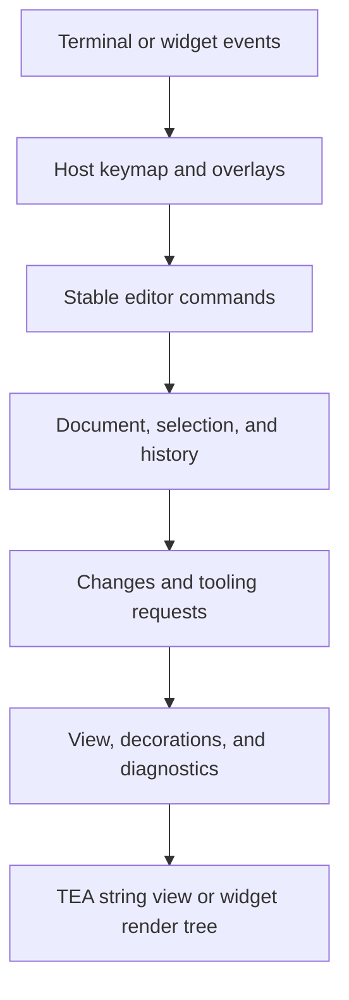

# Editor core

Artisanal's editor core is a host-independent collection of document, editing,
selection, viewport, tooling, and persistence primitives. It powers the
`TextAreaModel` TEA component and the editors in `artisanal_widgets`, but it can
also be used directly to build a custom terminal editor, prompt composer, diff
viewer, or language-tooling integration.

```dart
import 'package:artisanal/editor_core.dart';
```

The editor core deliberately does not own a terminal event loop, file system,
LSP process, native parser, or visual component tree. A host chooses those
pieces and uses the same core types to keep behavior consistent.

## Choose an integration level

| Need | Start with | Import |
|---|---|---|
| A multiline editor in a TEA application | `TextAreaModel` | `package:artisanal/bubbles.dart` |
| Documents, commands, or tooling without UI | Editor core | `package:artisanal/editor_core.dart` |
| Flutter-inspired terminal widgets | `TextArea`, `TextEditor`, `CodeEditor`, or `MarkdownEditor` | `package:artisanal_widgets/editors.dart` |
| Cell-level rendering or terminal protocols | Ultraviolet | `package:ultraviolet/ultraviolet.dart` |

Prefer `TextAreaModel` unless you need to own document storage, cursor
semantics, or rendering yourself. It already integrates undo/redo,
multi-selection, search, diagnostics, completions, code actions, syntax
decorations, folds, paste scheduling, and named commands.

## Guide map

1. [Fundamentals](fundamentals.md) — documents, grapheme offsets, positions,
   selections, changes, snapshots, and extmarks.
2. [Editing and commands](editing.md) — pure edit functions, `TextAreaModel`,
   transactions, undo/redo, multiple cursors, command registries, keymaps, and
   command palettes.
3. [Presentation](presentation.md) — viewports, wrapping, scrolling, hit
   testing, decoration layers, diagnostics, line numbers, and folding.
4. [Language tooling](language-tooling.md) — language adapters, syntax
   providers, syntax trees, search/replace, completions, code actions,
   snippets, bracket matching, and workspace edits.
5. [Host integration](integration.md) — TEA and widget hosts, persistence,
   large-document budgets, paste placeholders, inline elements, media,
   external editors, and testing.

## Feature map

| Area | Main APIs |
|---|---|
| Document | `TextDocument`, `TextDocumentChange`, `TextPosition` |
| Single selection | `EditorState`, `TextSelection` |
| Multiple selections | `TextSelectionSet`, `TextSelectionRange` |
| Editing | `textInsertText`, `textDeletePrevious`, `textMoveByWord`, line transforms |
| History | `EditHistoryController`, `UndoManager`, `TextAreaModel.undo` |
| Commands | `EditorCommand`, `EditorCommandRegistry`, `EditorKeymap` |
| Command UI state | `EditorCommandPalette`, shared command-palette controller |
| Layout | `TextView`, `TextViewport`, `TextHitResult` |
| Decorations | `TextDecorationRange`, `TextLineDecoration`, layer priorities |
| Diagnostics | `TextDiagnosticRange`, pattern diagnostics, navigation |
| Search | `TextSearchQuery`, `TextSearchSession`, replacement templates |
| Syntax | `TextSyntaxProvider`, `AsyncTextSyntaxProvider`, incremental patches |
| Language behavior | `EditorLanguageAdapter`, `EditorLanguageRegistry` |
| Structure | `EditorSyntaxTree`, `SyntaxTreeProvider`, bracket matching, folds |
| Tooling | completion and code-action providers, `WorkspaceEdit` |
| Snippets | `parseSnippet`, `SnippetSession` |
| Anchors | `TextExtmarksController`, `InlineElementStore` |
| Persistence | `EditorPersistenceSession`, `EditorDocumentStore` |
| Scale policy | `EditorWorkBudget`, `EditorWorkAssessment` |

## Minimal TEA editor

```dart
import 'package:artisanal/bubbles.dart';
import 'package:artisanal/tui.dart';

final class EditorApp implements Model {
  EditorApp(this.editor);

  factory EditorApp.initial() => EditorApp(
        TextAreaModel(
          showLineNumbers: true,
          useVirtualCursor: true,
        )..setText('void main() {\n  print("hello");\n}'),
      );

  TextAreaModel editor;

  @override
  Cmd? init() => editor.focus();

  @override
  (Model, Cmd?) update(Msg msg) {
    if (msg case WindowSizeMsg(width: final width, height: final height)) {
      editor
        ..setWidth(width)
        ..setHeight(height);
    }
    final (next, cmd) = editor.update(msg);
    editor = next;
    return (this, cmd);
  }

  @override
  String view() => editor.view().toString();
}

Future<void> main() => runProgram(
      EditorApp.initial(),
      options: const ProgramOptions(
        altScreen: true,
        bracketedPaste: true,
      ),
    );
```

In a real full-screen app, reserve rows for headers and footers before calling
`setHeight`. See the
[`advanced-editor`](../../pkgs/artisanal/example/tui/examples/advanced-editor/main.dart)
example for a complete alternate-screen host.

## Architectural rule

Keep data and intent below presentation:



This separation lets a TEA component, a widget editor, and a test harness invoke
the same operation without translating behavior through UI-specific code.

### Kernel design guarantees

The editor kernel follows three rules:

1. **Ranges are the currency of movement.** An `EditorRangeResolver` maps a
   document and selection set to a new selection set. Character, word, line,
   vertical, and fold-aware movement use the same range transforms for one
   cursor or many cursors.
2. **Keys resolve to commands.** `TextAreaModel` routes insertion, deletion,
   newline, motion, indentation, and folding through stable command IDs.
   Argument-taking commands such as `insertText` also cover typed input. A host
   can intercept input and dispatch the same commands without modifying the
   textarea.
3. **The view is a projection.** Folding changes which logical lines
   `TextView` projects into visual rows; it does not rewrite the document.
   Visible rows retain their logical line numbers, and vertical movement skips
   collapsed bodies.

These rules are editing-style-neutral. A modal host can map mode-specific keys
to commands or range resolvers, while an insert-only host continues to use the
same kernel unchanged.

## Important conventions

- Document offsets and columns are **grapheme offsets**, not UTF-16 code-unit
  indexes. A user-perceived character such as an emoji sequence occupies one
  editor offset.
- Lines, columns, and offsets are zero-based. Ranges are normally half-open:
  `[startOffset, endOffset)`.
- `TextDocument.copy()` is cheap and shares storage until a copy is changed.
- The pure `WorkspaceEdit` string helpers are an exception: they apply edits
  directly to Dart strings, so their offsets are UTF-16 code-unit indexes.
  Convert at that boundary or apply the edit through `TextDocument`.
- Core providers return data. Hosts own popups, loading indicators, process
  lifecycle, file I/O, and error presentation.
- Asynchronous sessions reject stale results; always use the session result
  rather than publishing a provider result directly.
- Decorations describe semantic style keys. The host maps those keys to
  concrete terminal styles.

## Examples

- [`advanced-editor`](../../pkgs/artisanal/example/tui/examples/advanced-editor/main.dart):
  full-screen editing, command palette, search/replace, syntax, diagnostics,
  completion, code actions, snippets, folds, persistence, and recovery.
- [`prompt-composer`](../../pkgs/artisanal/example/tui/examples/prompt-composer/main.dart):
  tracked paste blocks, prompt normalization, external-editor round trips, and
  IDE selection context.
- [`media-composer`](../../pkgs/artisanal/example/tui/examples/media-composer/main.dart):
  typed inline elements, attachments, preview overlays, and image viewers.
