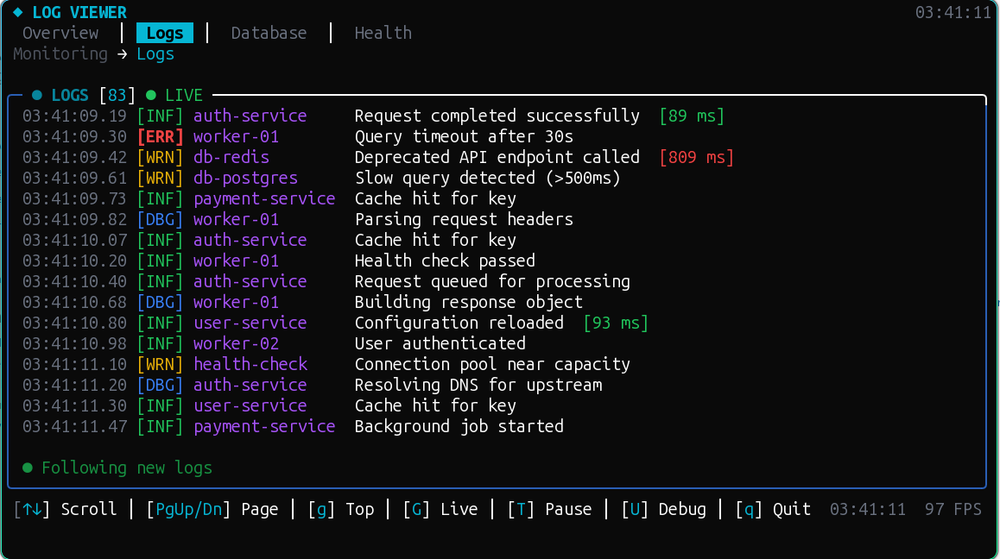
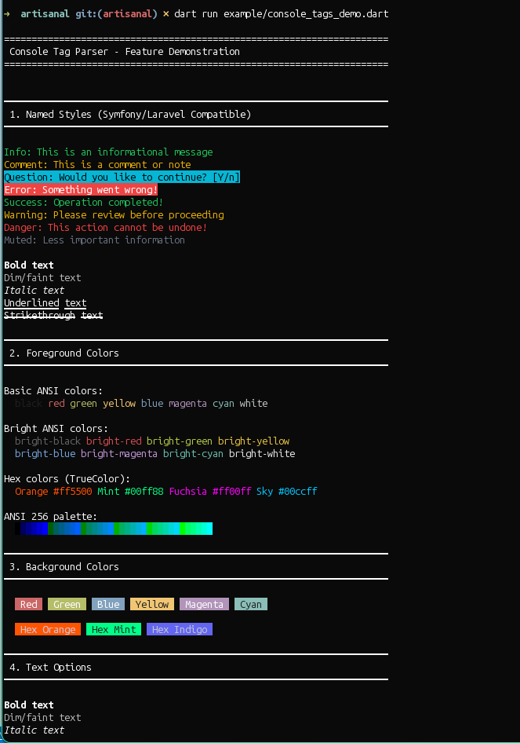
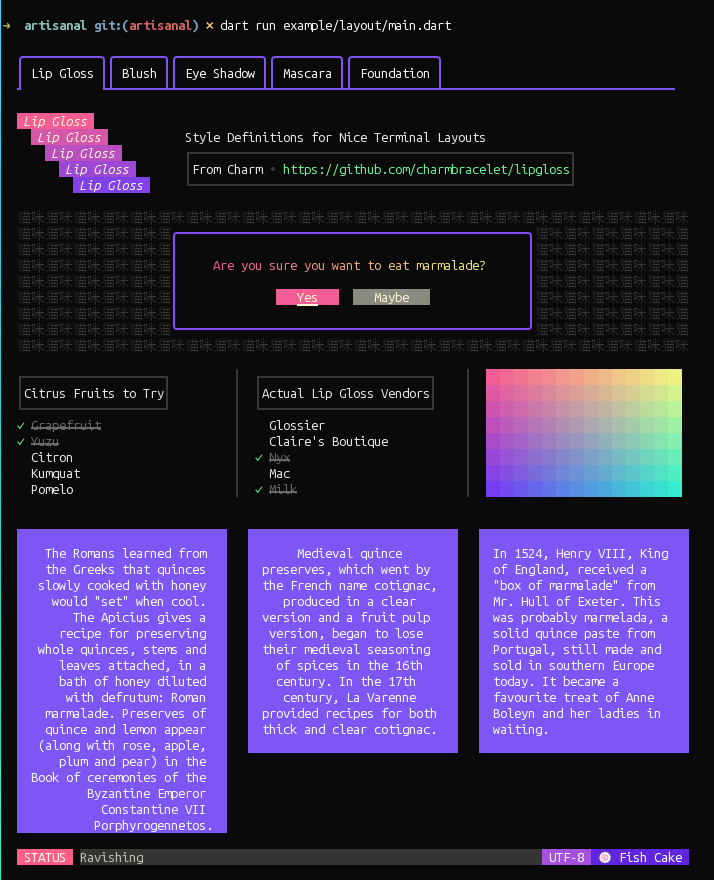
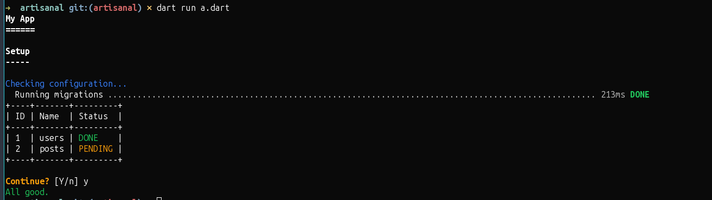
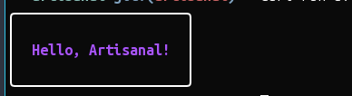
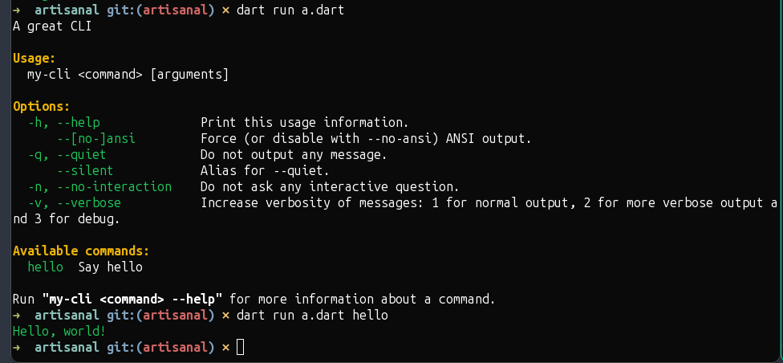

# Artisanal

> **About this project:**
>
> This library is a faithful port of Charm's TUI libraries (Lip Gloss, Bubble Tea, Bubbles) to Dart. We aim to port as much functionality as possible. In some scenarios, things may not work as expected—please report any issues you discover so we can adjust where necessary.
>
> Many of the included examples were generated and may contain issues or not reflect the latest API. If you find a broken or outdated example, please let us know!

> **⚠️ Work in Progress:**
>
> This library is under active development and its API may change. Some examples may be broken or require updates to match the latest state of the package. If you discover any broken or outdated examples, please report them or open an issue. Thank you for your understanding!

[](https://opensource.org/licenses/MIT)
[](https://ormed.vercel.app/)
[](https://www.buymeacoffee.com/kingwill101)

A full-stack terminal toolkit for Dart, inspired by popular Go terminal libraries: [Lip Gloss](https://github.com/charmbracelet/lipgloss) (styling), [Bubble Tea](https://github.com/charmbracelet/bubbletea) (TUI framework), and [Bubbles](https://github.com/charmbracelet/bubbles) (reusable widgets).

Build everything from rich command-line tools to complex interactive TUI applications with a consistent, idiomatic Dart API.

## Features

| Feature | Description |
|---------|-------------|
| **CLI I/O** | High-level `Console` helpers for status lines, tables, tasks, prompts, and styled output |
| **Styling** | Fluent, immutable `Style` API with colors, borders, padding, margins, and themes |
| **TUI Runtime** | Elm Architecture (`Model`/`Msg`/`Cmd`) with a full-featured `Program` event loop |
| **Bubbles** | 20+ reusable widgets: inputs, lists, tables, spinners, progress bars, file pickers, etc. |
| **Ultraviolet (UV)** | High-performance cell-buffer renderer with diff-based updates and graphics support |
| **Terminal + Renderer** | Unified terminal abstraction, ANSI helpers, and renderer backends |
| **Markdown** | ANSI Markdown renderer plus Glamour high-fidelity output |
| **Charting** | Sparklines, line/ribbon charts, histograms, heatmaps, and pie charts |

## Installation

```yaml
dependencies:
  artisanal: ^0.2.0
```

> **Note**: This package uses workspace resolution. Use a path or git reference in standalone projects.

If you are building a widget app and do not need the rest of the CLI/style/runtime
toolkit from this package, prefer depending on `artisanal_widgets` directly.
Use `package:artisanal/...` as the umbrella convenience surface when you want
the broader stack from a single package.


## 🖼️ Screenshots








## Library Exports

| Import | Purpose |
|--------|---------|
| `package:artisanal/artisanal.dart` | Full CLI kit (Console, Style, Terminal, Layout) |
| `package:artisanal/args.dart` | Command runner utilities (`CommandRunner`, `Command`) |
| `package:artisanal/style.dart` | Styling, Layout, Colors, Borders, Themes |
| `package:artisanal/runtime.dart` | Focused TEA runtime surface (`Model`, `Msg`, `Cmd`, `Program`, `StringTerminal`, runtime messages) |
| `package:artisanal/hosts.dart` | Terminal backends, bridges, browser/socket hosts |
| `package:artisanal/plugins.dart` | Stable remote-surface plugin protocol, transport, sessions, and host surface state |
| `package:artisanal/tui.dart` | TUI runtime: Model, Msg, Cmd, Program |
| `package:artisanal/bubbles.dart` | Reusable interactive widgets |
| `package:artisanal/terminal.dart` | Terminal abstraction, ANSI codes, Keys |
| `package:artisanal/app.dart` | Stable widget app shells, runners, and hosted wrappers |
| `package:artisanal/editors.dart` | Stable widget text inputs and editors |
| `package:artisanal/selection.dart` | Stable widget text selection |
| `package:artisanal/testing.dart` | Stable widget testing helpers |
| `package:artisanal/widgets.dart` | Stable re-export of the widget framework, including shortcut and zone-hit message support |
| `package:ultraviolet/ultraviolet.dart` | Low-level cell-buffer renderer |
| `package:artisanal/uv.dart` | Compatibility re-export for UV (`package:ultraviolet/ultraviolet.dart`) |
| `package:artisanal/markdown.dart` | Markdown to ANSI renderer |
| `package:artisanal/glamour.dart` | High-fidelity Markdown renderer |
| `package:artisanal/charting.dart` | Charting primitives |

For widget work, the `package:artisanal/...` widget entrypoints are convenience
re-exports of the primary `package:artisanal_widgets/...` libraries. Prefer the
direct `artisanal_widgets` imports when that is the only package your app
needs.

## Documentation

See the in-repo docs for full coverage:

- `docs/DOCS_INDEX.md`

## Quick Start: CLI Output

```dart
import 'package:artisanal/artisanal.dart';

Future<void> main() async {
  final io = Console();

  io.title('My App');
  io.section('Setup');
  io.info('Checking configuration...');

  await io.task('Running migrations', run: () async {
    await Future.delayed(const Duration(milliseconds: 200));
    return TaskResult.success;
  });

  io.table(
    headers: ['ID', 'Name', 'Status'],
    rows: [
      [1, 'users', io.style.success('DONE')],
      [2, 'posts', io.style.warning('PENDING')],
    ],
  );

  final proceed = io.confirm('Continue?', defaultValue: true);
  if (!proceed) return;

  io.success('All good.');
}
```




## Quick Start: Styling (Lip Gloss)

```dart
import 'package:artisanal/style.dart';

final style = Style()
    .bold()
    .foreground(Colors.purple)
    .padding(1, 2)
    .border(Border.rounded);

print(style.render('Hello, Artisanal!'));
```




### Style Capabilities

- **Text effects**: `bold()`, `italic()`, `underline()`, `strikethrough()`, `dim()`, `inverse()`, `blink()`
- **Colors**: ANSI 16, ANSI 256, TrueColor (RGB), `AdaptiveColor` (light/dark aware)
- **Spacing**: `padding()`, `margin()`
- **Borders**: `rounded`, `thick`, `double`, `hidden`, custom
- **Alignment**: `align()`, `alignVertical()`
- **Dimensions**: `width()`, `height()`, `maxWidth()`, `maxHeight()`
- **Themes**: `ThemePalette` with presets (dark, light, ocean, nord, dracula, monokai, solarized)

## Quick Start: TUI (Elm Architecture)

```dart
import 'package:artisanal/runtime.dart';

class CounterModel implements Model {
  final int count;
  const CounterModel([this.count = 0]);

  @override
  Cmd? init() => null;

  @override
  (Model, Cmd?) update(Msg msg) {
    return switch (msg) {
      KeyMsg(key: Key(type: KeyType.up)) => (CounterModel(count + 1), null),
      KeyMsg(key: Key(type: KeyType.down)) => (CounterModel(count - 1), null),
      KeyMsg(key: Key(type: KeyType.runes, runes: [0x71])) => (this, Cmd.quit()),
      _ => (this, null),
    };
  }

  @override
  String view() => 'Count: \$count\n\nUse ↑/↓ to change, q to quit';
}

Future<void> main() async {
  await runProgram(CounterModel());
}
```

## Replay + Trace Debugging

The TUI runtime supports deterministic replay (`ProgramReplay`) and built-in
file tracing (`TuiTrace`) for debugging and profiling.

Enable tracing for any TUI app:

```bash
ARTISANAL_TUI_TRACE=1 ARTISANAL_TUI_TRACE_CAPTURE=1 \
ARTISANAL_TUI_TRACE_PATH=traces/my-run.log \
dart run your_app.dart
```

Structured app/domain events can be emitted via `TuiTrace.event(...)` and are
preserved in replay conversion when they use stable typed `type` names.

Full replay and tracing documentation: `docs/TUI.md`.

## Remote Plugin Surfaces

`package:artisanal/plugins.dart` provides the supported out-of-process plugin
surface for remote-rendered plugins.

The current model is host-rendered composition with plugin-rendered content:

- the host normally launches a plugin process through
  `RemotePluginHostConnection.startProcess(...)`,
  `RemotePluginHostConnection.startManifest(...)`, or
  `RemotePluginHostConnection.startManifestFile(...)`
- the plugin process binds stdin/stdout with `RemotePluginGuestSession`
- plugin UI is described as remote surfaces plus sparse frame cells
- the bundled host connection binds `RemotePluginSurfaceController` for
  surface lifecycle/state and can route focus/mouse/key input through
  `RemotePluginSurfaceInputRouter`
- host-owned capabilities such as clipboard, URL opening, notifications, and
  file picking should normally travel through the generic
  `plugin.service.request` / `host.service.response` envelope when the host
  advertises `services`
- hosts can optionally include explicit `RemotePluginServiceDescriptor`s in
  `host.hello`, so guests can discover which `service.method` pairs and JSON
  schemas are actually available instead of relying on the coarse capability
  flag alone
- `RemotePluginGenericServiceCatalog` lets hosts register those generic
  services once, reuse the derived descriptors in `host.hello`, and then bind
  the same handlers to a `RemotePluginHostConnection`
- `RemotePluginProtocolSchemas` and `RemotePluginManifestSchemas` expose
  `json_schema_builder` schemas for the full message protocol, per-message
  envelopes, and manifest files so non-Dart tooling can validate the same
  wire format the host and guest libraries use
- the older typed per-service request/response messages are still available as
  a compatibility fallback for older hosts and guests

Run the end-to-end reference demo:

```bash
dart run pkgs/artisanal/example/tui/remote_plugin_host_demo.dart
```

That launches the matching guest process automatically and prints the rendered
surface state the host received from the plugin.

Run the full multi-plugin workspace example:

```bash
dart run pkgs/artisanal/example/tui/remote_plugin_workspace/host/main.dart
```

That example discovers plugin manifests, launches several plugin processes,
routes focus/input across composed surfaces, and dogfoods the generic host
service registry through the shared `services` capability.

Dump the current JSON schemas:

```bash
dart run pkgs/artisanal/example/tui/remote_plugin_schema_dump.dart
dart run pkgs/artisanal/example/tui/remote_plugin_schema_dump.dart --manifest
dart run pkgs/artisanal/example/tui/remote_plugin_schema_dump.dart --message-type=plugin.service.request
dart run pkgs/artisanal/example/tui/remote_plugin_schema_dump.dart --built-in-services
```

## Bubbles (Reusable Widgets)

| Widget | Description |
|--------|-------------|
| `TextInputModel` | Single-line text input |
| `TextAreaModel` | Multi-line text editing |
| `ListModel` | Filterable list selection |
| `TableModel` | Interactive tables |
| `ViewportModel` | Scrollable content pane |
| `ProgressModel` | Progress bars with ETA |
| `SpinnerModel` | Animated loading spinners |
| `FilePickerModel` | File/directory browser |
| `AnticipateModel` | Autocomplete with suggestions |
| `WizardModel` | Multi-step form wizard |
| `SelectModel<T>` | Single-choice selection prompt |
| `MultiSelectModel<T>` | Multiple-choice selection |
| `PasswordModel` | Masked password input |
| `TimerModel` | Countdown timer |
| `StopwatchModel` | Elapsed time tracking |
| `PaginatorModel` | Pagination controls |
| `HelpModel` | Key binding help views |

## Command Runner

Build CLI tools with styled help and nested commands:

```dart
import 'package:artisanal/args.dart';

class HelloCommand extends Command {
  @override
  String get name => 'hello';
  
  @override
  String get description => 'Say hello';

  @override
  void run() {
    io.success('Hello, world!');
  }
}

void main(List<String> args) {
  final runner = CommandRunner('my-cli', 'A great CLI');
  runner.addCommand(HelloCommand());
  runner.run(args);
}
```



## Ultraviolet Renderer

High-performance rendering with diff-based updates for flicker-free TUI applications:

```dart
await runProgram(
  MyModel(),
  options: const ProgramOptions(
    useUltravioletRenderer: true,
    useUltravioletInputDecoder: true,
    altScreen: true,
    mouse: true,
  ),
);
```

### UV Features

- 2D cell buffer with styled cells
- Diff-based terminal updates (minimal redraws)
- Layer composition and hit-testing
- Mouse support and focus events
- Graphics: Kitty, Sixel, iTerm2, half-block drawing

## Console Methods

| Category | Methods |
|----------|---------|
| **Output** | `writeln()`, `write()`, `title()`, `section()` |
| **Messages** | `line()`, `info()`, `comment()`, `question()`, `warn()`, `error()`, `note()`, `caution()`, `alert()`, `verbose()`, `debug()` |
| **Layout** | `table()`, `tree()`, `listing()`, `twoColumnDetail()`, `text()` |
| **Interactive** | `ask()`, `confirm()`, `choice()`, `secret()`, `selectChoice()`, `multiSelectChoice()`, `menu()`, `search()` |
| **Progress** | `task()`, `spin()`, `progress()`, `progressIterate()` |

## Examples

See the `example/` directory for comprehensive demos:

- `main.dart` – Full feature showcase
- `fluent_style_example.dart` – Style API patterns
- `spinner_demo.dart` – Various spinner types
- `lipgloss_table.dart` – Styled tables
- `log_viewer_demo.dart` – Monitoring dashboard
- `command_center_demo.dart` – Multi-panel layouts
- UV-specific demos now live in `pkgs/ultraviolet/example/`
