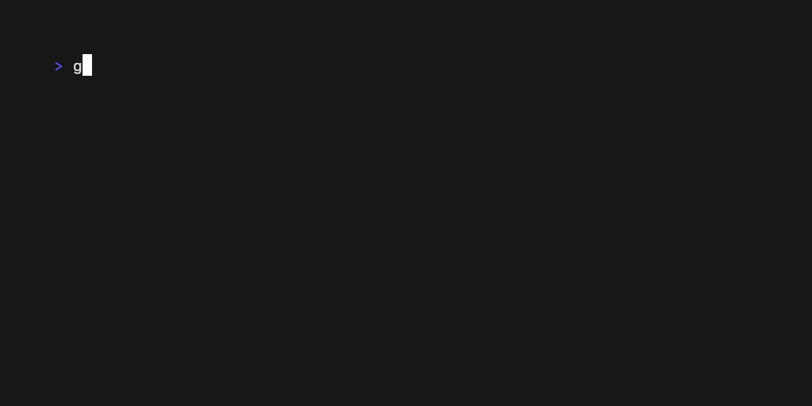
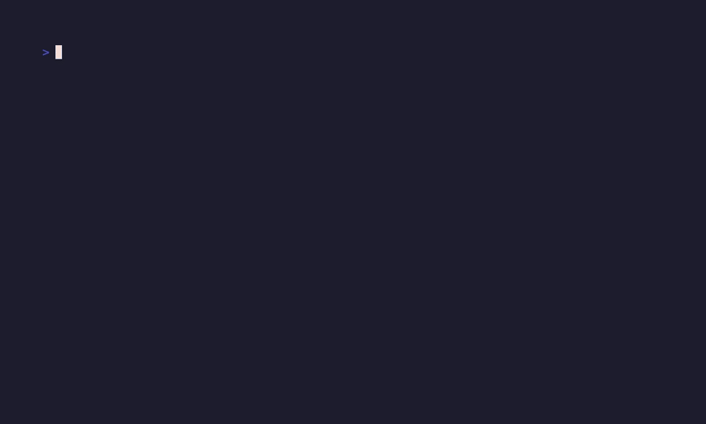
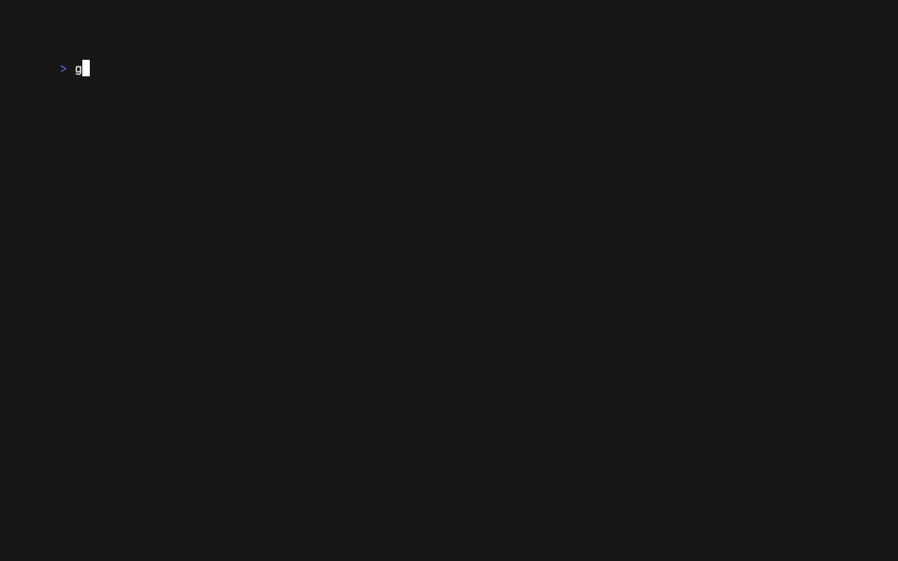
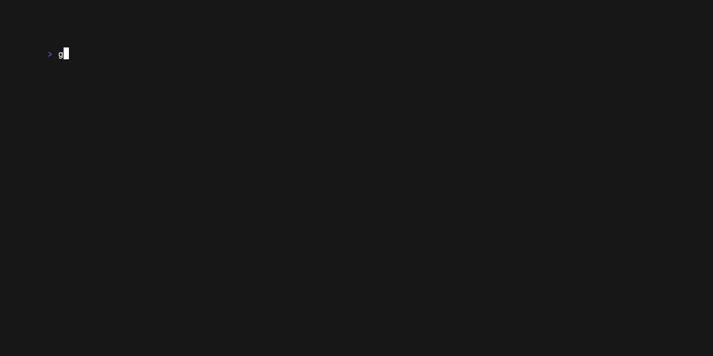
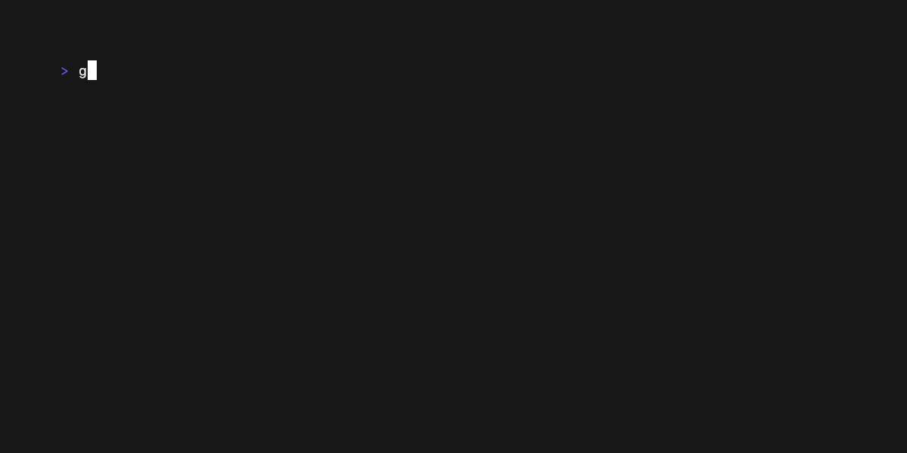
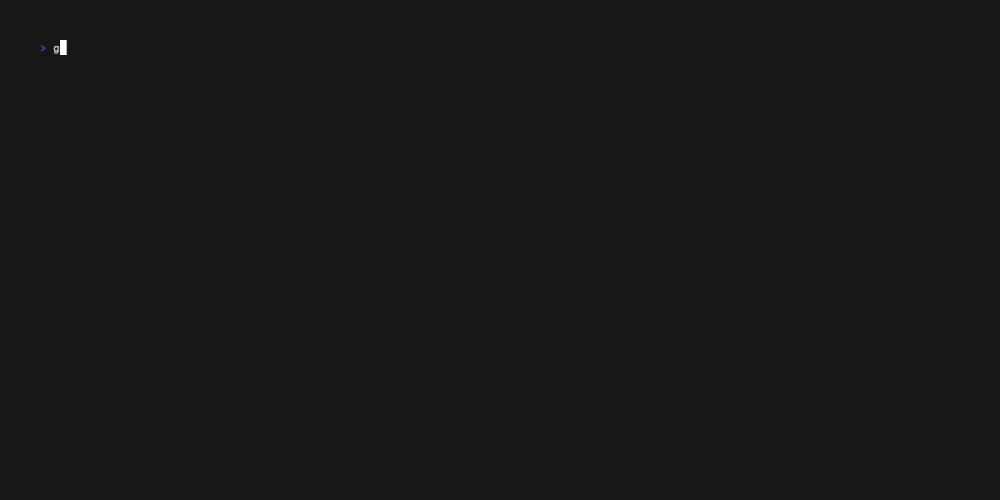
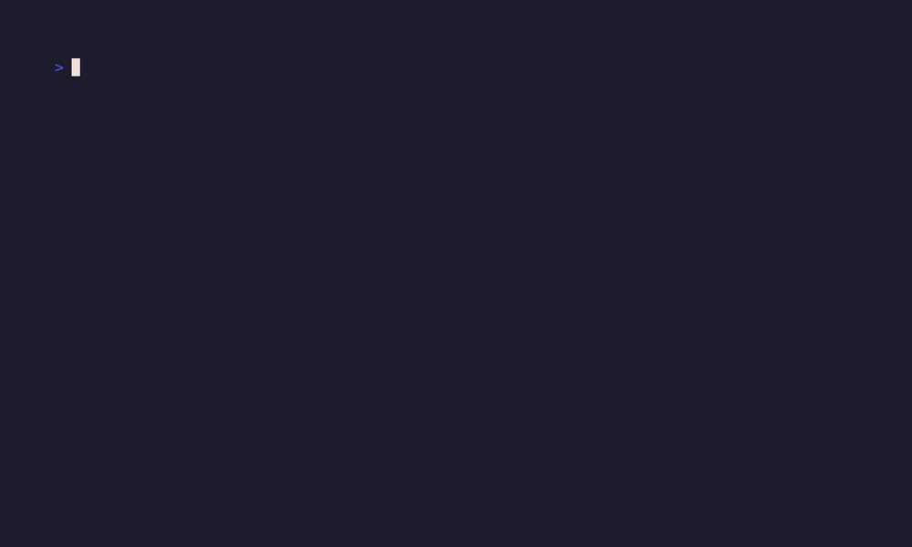
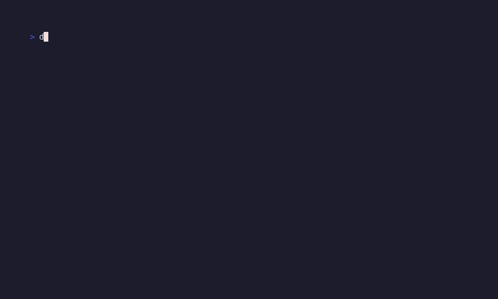

# Examples

This directory mirrors the Bubble Tea examples as Dart ports. Each folder contains a runnable Dart implementation (`main.dart`) for artisanal's Bubble Tea-style runtime. To try an example from the package root:

```bash
dart run example/tui/examples/<example>/main.dart
```

### Alt Screen Toggle

The `altscreen-toggle` example shows how to transition between the alternative
screen buffer and the normal screen buffer using Bubble Tea.

<a href="./altscreen-toggle/main.dart">
  
</a>

### Chat

The `chat` examples shows a basic chat application with a multi-line `textarea`
input.

<a href="./chat/main.dart">
  
</a>

### Composable Views

The `composable-views` example shows how to compose two bubble models (spinner
and timer) together in a single application and switch between them.

<a href="./composable-views/main.dart">
  
</a>

### Credit Card Form

The `credit-card-form` example demonstrates how to build a multi-step form with
`textinputs` bubbles and validation on the inputs.

<a href="./credit-card-form/main.dart">
  
</a>

### Debounce

The `debounce` example shows how to throttle key presses to avoid overloading
your Bubble Tea application.

<a href="./debounce/main.dart">
  
</a>

### Layout

The `layout` example shows how to use `Layout.joinVertical` and
`Layout.joinHorizontal` to build a responsive, width-aware card layout.

<a href="./layout/main.dart">
  
</a>

### Layout Breakpoints

The `layout-breakpoints` example demonstrates threshold-based layout decisions
using `ResponsiveBreakpoints` with `isAtLeast`, `isBelow`, and `resolve`.

<a href="./layout-breakpoints/main.dart">
  
</a>

### Evidence Logging

The `evidence-logging` examples show how to emit runtime `TuiEvidence` records
to JSONL and how to parse them with `TuiEvidence.tryParseLine`.

<a href="./evidence-logging/main.dart">
  
</a>

<a href="./evidence-logging/inspect.dart">
  Inspect log utility
</a>

<a href="./evidence-logging/summary.dart">
  Summarize log utility
</a>

<a href="./evidence-logging/toggle.dart">
  Toggle logging mode utility
</a>

<a href="./evidence-logging/render_budget.dart">
  Render-budget diagnostics demo
</a>

### Macro Recorder/Player

The `macro-recorder` example records runtime key traffic into a
`ProgramMacro`, replays it, and demonstrates stopping looped playback.

<a href="./macro-recorder/main.dart">
  
</a>

### Exec

The `exec` example shows how to execute a running command during the execution
of a Bubble Tea application such as launching an `EDITOR`.
 
<a href="./exec/main.dart">
  
</a>

### Full Screen

The `fullscreen` example shows how to make a Bubble Tea application fullscreen.

<a href="./fullscreen/main.dart">
  
</a>

### Glamour

The `glamour` example shows how to use [Glamour](https://github.com/charmbracelet/glamour) inside a viewport bubble.

<a href="./glamour/main.dart">
  
</a>

### Markdown

The `markdown` example parses Markdown with `package:markdown`, renders ANSI
with `renderMarkdown`, and displays it inside a viewport.

<a href="./markdown/main.dart">
  
</a>

### Help

The `help` example shows how to use the `help` bubble to display help to the
user of your application.

<a href="./help/main.dart">
  
</a>

### Http

The `http` example shows how to make an `http` call within your Bubble Tea
application.

<a href="./http/main.dart">
  
</a>

### Key Chord

The `key-chord` example demonstrates engine-level chord key bindings using
`KeyChordInterceptor`. Prefix keys like `Ctrl+X` are intercepted and a
second key (e.g., `t` or `m`) resolves the chord. Timeout and cancellation
are also shown.

<a href="./key-chord/main.dart">
  Code
</a>

### Inline

The `inline` examples run on the primary terminal screen and preserve native
scrollback while a top or bottom UI remains pinned. The bottom dashboard
examples stream `Cmd.println` output above the UI, which is the same class of
behavior needed by long-running command dashboards.

<a href="./inline/README.md">
  Code
</a>

### Default List

The `list-default` example shows how to use the list bubble.

<a href="./list-default/main.dart">
  
</a>

### Fancy List

The `list-fancy` example shows how to use the list bubble with extra customizations.

<a href="./list-fancy/main.dart">
  
</a>

### Simple List

The `list-simple` example shows how to use the list and customize it to have a simpler, more compact, appearance.

<a href="./list-simple/main.dart">
  
</a>

### Mouse

The `mouse` example shows how to receive mouse events in a Bubble Tea
application.

<a href="./mouse/main.dart">
  
</a>

### Package Manager

The `package-manager` example shows how to build an interface for a package
manager using output commands such as `tui.Cmd.println` / `tui.Cmd.printf`.

<a href="./package-manager/main.dart">
  
</a>

### Pager

The `pager` example shows how to build a simple pager application similar to
`less`.

<a href="./pager/main.dart">
  
</a>

### Paginator

The `paginator` example shows how to build a simple paginated list.

<a href="./paginator/main.dart">
  
</a>

### Pipe

The `pipe` example demonstrates using shell pipes to communicate with Bubble
Tea applications.

<a href="./pipe/main.dart">
  
</a>

### Animated Progress

The `progress-animated` example shows how to build a progress bar with an
animated progression.

<a href="./progress-animated/main.dart">
  
</a>

### Download Progress

The `progress-download` example demonstrates how to download a file while
indicating download progress through Bubble Tea.

<a href="./progress-download/main.dart">
  
</a>

### Static Progress

The `progress-static` example shows a progress bar with static incrementation
of progress.

<a href="./progress-static/main.dart">
  
</a>

### Real Time

The `realtime` example demonstrates the use of go channels to perform realtime
communication with a Bubble Tea application.

<a href="./realtime/main.dart">
  
</a>

### Result

The `result` example shows a choice menu with the ability to select an option.

<a href="./result/main.dart">
  
</a>

### Send Msg

The `send-msg` example demonstrates the usage of custom `tui.Msg`s.

<a href="./send-msg/main.dart">
  
</a>

### Sequence

The `sequence` example demonstrates the `tui.Cmd.sequence` command.

<a href="./sequence/main.dart">
  
</a>

### Simple

The `simple` example shows a very simple Bubble Tea application.

<a href="./simple/main.dart">
  
</a>

### Spinner

The `spinner` example demonstrates a spinner bubble being used to indicate loading.

<a href="./spinner/main.dart">
  
</a>

### Spinners

The `spinner` example shows various spinner types that are available.

<a href="./spinners/main.dart">
  
</a>

### Split Editors

The `split-editors` example shows multiple `textarea`s being used in a single
application and being able to switch focus between them.

<a href="./split-editors/main.dart">
  
</a>

### Stop Watch

The `stopwatch` example shows a sample stop watch built with Bubble Tea.

<a href="./stopwatch/main.dart">
  
</a>

### Table

The `table` example demonstrates the table bubble being used to display tabular
data.

<a href="./table/main.dart">
  
</a>

### Tabs

The `tabs` example demonstrates tabbed navigation styled with [Lip Gloss](https://github.com/charmbracelet/lipgloss).

<a href="./tabs/main.dart">
  
</a>

### Text Area

The `textarea` example demonstrates a simple Bubble Tea application using a
`textarea` bubble.

<a href="./textarea/main.dart">
  
</a>

### Text Input

The `textinput` example demonstrates a simple Bubble Tea application using a `textinput` bubble.

<a href="./textinput/main.dart">
  
</a>

### Multiple Text Inputs

The `textinputs` example shows multiple `textinputs` and being able to switch
focus between them as well as changing the cursor mode.

<a href="./textinputs/main.dart">
  
</a>

### Timer

The `timer` example shows a simple timer built with Bubble Tea.

<a href="./timer/main.dart">
  
</a>

### TUI Daemon

The `tui-daemon-combo` demonstrates building a text-user interface along with a
daemon mode using Bubble Tea.

<a href="./tui-daemon-combo/main.dart">
  
</a>

### Views

The `views` example demonstrates how to build a Bubble Tea application with
multiple views and switch between them.

<a href="./views/main.dart">
  
</a>

### Autocomplete

The `autocomplete` example shows tab-completion in a text input.

<a href="./autocomplete/main.dart">
  
</a>

### Border Showcase

The `border_showcase` example shows border styles, titles, and colors.

<a href="./border_showcase/main.dart">
  
</a>

### Cell Buffer

The `cellbuffer` example demonstrates low-level cell-buffer rendering.

<a href="./cellbuffer/main.dart">
  
</a>

### Components Host

The `components-host` example hosts view components in a demo shell.

<a href="./components-host/main.dart">
  
</a>

### Eyes

The `eyes` example is a blinking-eyes animation ported from Bubble Tea.

<a href="./eyes/main.dart">
  
</a>

### File Picker

The `file-picker` example shows the file-picker bubble.

<a href="./file-picker/main.dart">
  
</a>

### Focus Blur

The `focus-blur` example reports terminal focus and blur events.

<a href="./focus-blur/main.dart">
  
</a>

### Git Diff

The `git-diff` example shows the git-diff viewer bubble.

<a href="./git-diff/main.dart">
  
</a>

### Harness Demo

The `harness_demo` example demonstrates the program test harness with a counter model.

<a href="./harness_demo/main.dart">
  
</a>

### Hot Reload Test

The `hot_reload_test` example is a minimal hot-reload test app.

<a href="./hot_reload_test/main.dart">
  
</a>

### Keymap Hub

The `keymap-hub` example demonstrates the keymap-hub surface.

<a href="./keymap-hub/main.dart">
  
</a>

### Kitchen Sink

The `kitchen-sink` example is a composite demo of many bubbles at once.

<a href="./kitchen-sink/main.dart">
  
</a>

### Prevent Quit

The `prevent-quit` example intercepts quit and asks for confirmation first.

<a href="./prevent-quit/main.dart">
  
</a>

### Set Window Title

The `set-window-title` example sets the terminal window title.

<a href="./set-window-title/main.dart">
  
</a>

### Suspend

The `suspend` example demonstrates suspend and resume, ported from Bubble Tea.

<a href="./suspend/main.dart">
  
</a>

### Table Resize

The `table-resize` example shows a resizable data table.

<a href="./table-resize/main.dart">
  
</a>

### UV Effects

The `uv-effects` example shows Ultraviolet terminal effects.

<a href="./uv-effects/main.dart">
  
</a>

### UV Input

The `uv-input` example demonstrates the UV input decoder.

<a href="./uv-input/main.dart">
  
</a>

### Window Size

The `window-size` example shows live terminal dimensions and resize handling.

<a href="./window-size/main.dart">
  
</a>

### Zone

The `zone` example demonstrates clickable bubble zones.

<a href="./zone/main.dart">
  
</a>
