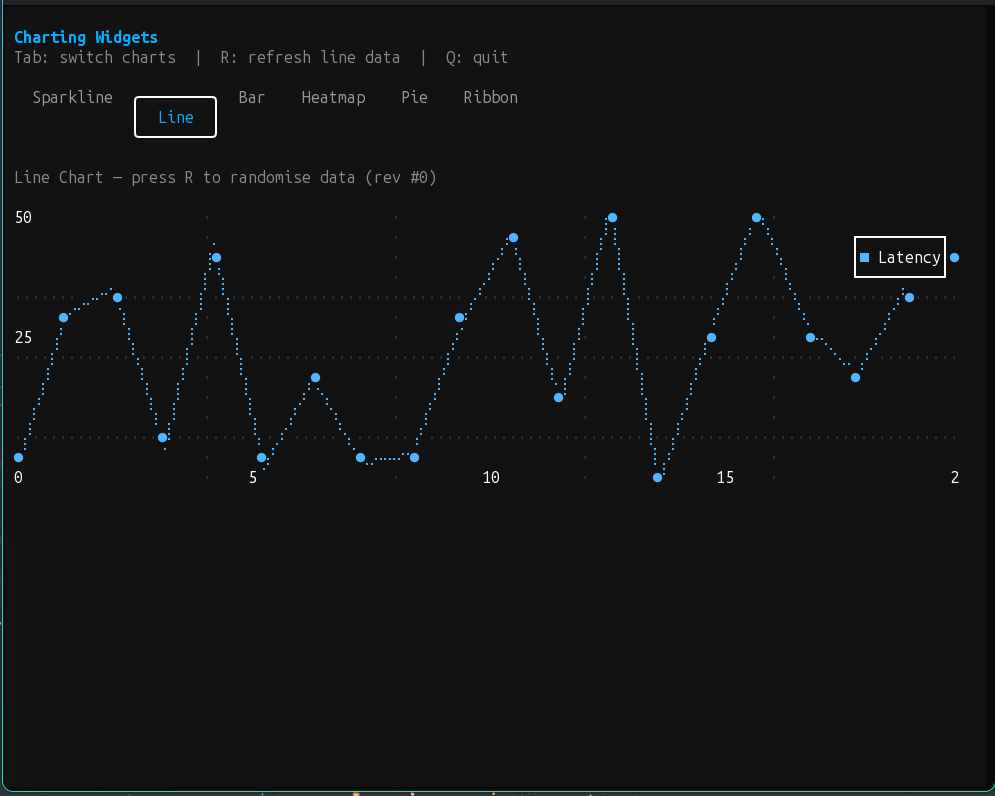
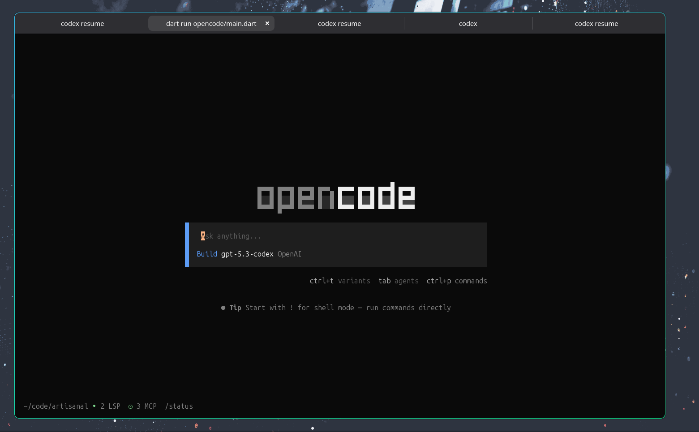
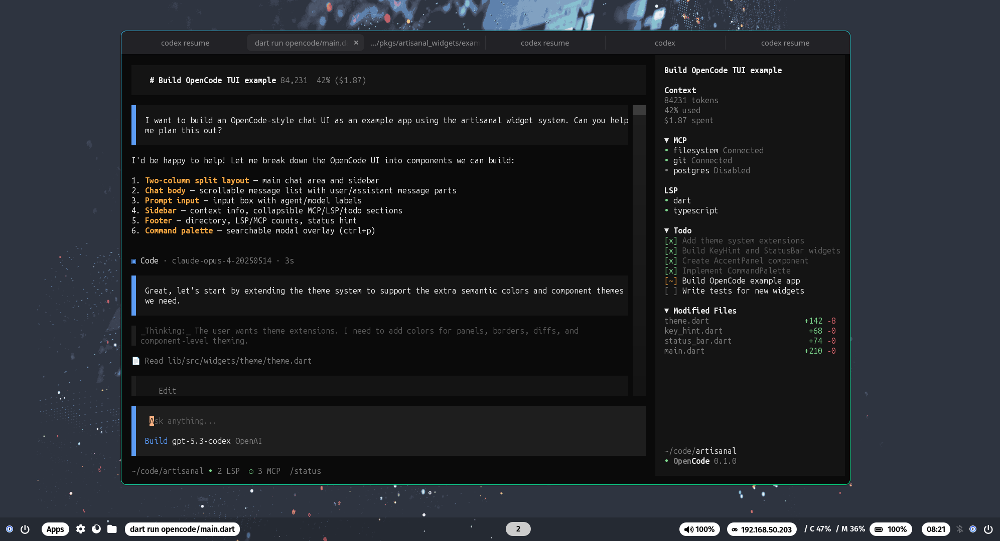
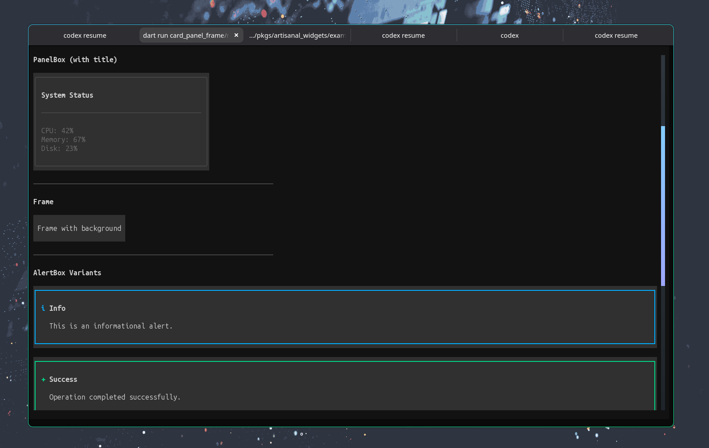

# artisanal_widgets

Flutter-inspired widget framework for terminal UIs, built on top of
`artisanal`.

## Table of Contents

- [Installation](#installation)
- [Import](#import)
- [Quick start](#quick-start)
- [Flutter-style component ports](#flutter-style-component-ports)
- [Program Instrumentation](#program-instrumentation)
- [Tests](#tests)
- [Command execution note](#command-execution-note)

## Installation

```yaml
dependencies:
  artisanal_widgets: ^0.1.0
```

## Import

```dart
import 'package:artisanal_widgets/app.dart';
import 'package:artisanal_widgets/widgets.dart';
```

Use the focused stable entrypoints when you need those modules:

- `package:artisanal_widgets/app.dart` for app shells, runners, reload helpers, and hosted wrappers
- `package:artisanal_widgets/charting.dart` for chart widgets
- `package:artisanal_widgets/editors.dart` for `TextField`, `TextArea`, `TextEditor`, `CodeEditor`, `MarkdownEditor`, and the stable `TextInputKeyMap` / `TextAreaKeyMap` customization surface
- `package:artisanal_widgets/selection.dart` for `SelectableText` and `SelectionArea`
- `package:artisanal_widgets/testing.dart` for `WidgetTester`

The main `package:artisanal_widgets/widgets.dart` barrel also re-exports
`KeyMap` and `KeyBinding`, so component-level shortcut UIs such as `HelpView`
and zone-hit messages such as `ZoneInBoundsMsg`, so shortcut and pointer-aware
widgets do not need an extra `package:artisanal/tui.dart` import.

Keep `package:artisanal_widgets/artisanal_widgets.dart` only when you
explicitly want the broader experimental compatibility surface.

Both the local runner helpers and the hosted browser/socket helpers accept an
`imageAutoMode` override. Hosted browser/socket runners now default
`Image(renderMode: auto)` to session-driven capability detection, while
`WidgetTester` keeps the portable half-block fallback for deterministic tests.

## Quick start

```dart
import 'package:artisanal_widgets/app.dart';
import 'package:artisanal_widgets/widgets.dart';

class HelloApp extends StatelessWidget {
  HelloApp({super.key});

  @override
  Widget build(BuildContext context) {
    final theme = ThemeScope.of(context);
    return Column(
      crossAxisAlignment: CrossAxisAlignment.start,
      children: [
        Text('Hello widgets', style: theme.titleLarge),
        Text('Press q to quit', style: theme.bodyMedium),
      ],
    );
  }
}

void main() async {
  await runArtisanalApp(
    ArtisanalApp(
      title: 'Hello widgets',
      home: HelloApp(),
    ),
  );
}
```

## Flutter-style component ports

- Chips: `Chip`, `ActionChip`, `ChoiceChip`, `FilterChip`, `InputChip`
- Menus: `DropdownButton`, `DropdownMenuItem`, `PopupMenuButton`,
  `PopupMenuItem`, `CheckedPopupMenuItem`, `PopupMenuDivider`
- Sliders: `Slider`, `RangeSlider`, `RangeValues`
- Indicators: `LinearProgressIndicator`, `CircularProgressIndicator`
- Charts: `SparklineChart`, `LineChart`, `BarChart`, `HeatmapChart`,
  `PieChart`, `RibbonChart` with optional in-chart legends


The OpenCode example is self-contained under
`example/opencode` (including local data models and theme assets).





## Program Instrumentation

The core TUI runtime (`Program`) supports general instrumentation and automation
for any app (not OpenCode-specific):

- `ProgramInterceptor` for message interception/timing hooks.
- `ProgramReplay` for deterministic event playback.

```dart
import 'package:artisanal/runtime.dart' as runtime;
import 'package:artisanal_widgets/app.dart';

final replay = runtime.ProgramReplay.script([
  runtime.ProgramReplayStep(
    after: Duration(milliseconds: 120),
    msg: runtime.KeyMsg(
      runtime.Key(runtime.KeyType.runes, runes: [0x61]),
    ),
  ),
  runtime.ProgramReplayStep(
    after: Duration(milliseconds: 16),
    msg: runtime.QuitMsg(),
  ),
]);

await runtime.runProgram(
  WidgetApp(MyApp()),
  options: runtime.ProgramOptions(replay: replay),
);
```

See the `package:artisanal/runtime.dart` API docs for full interceptor/replay
details.

## Tests

Component tests are split by widget under
`test/components/*_test.dart`.

Useful commands:

```bash
dart test test/components
dart test
dart analyze
```

## Command execution note

When combining commands that include runtime-managed commands (`EveryCmd`,
`StreamCmd`, or helpers like `every(...)`), use `ParallelCmd` so those commands
are started by `Program`.

Use `Cmd.batch(...)` for finite commands that only need `execute()`.
